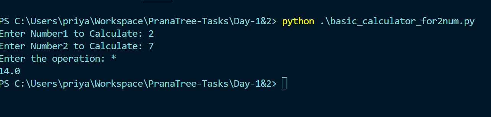
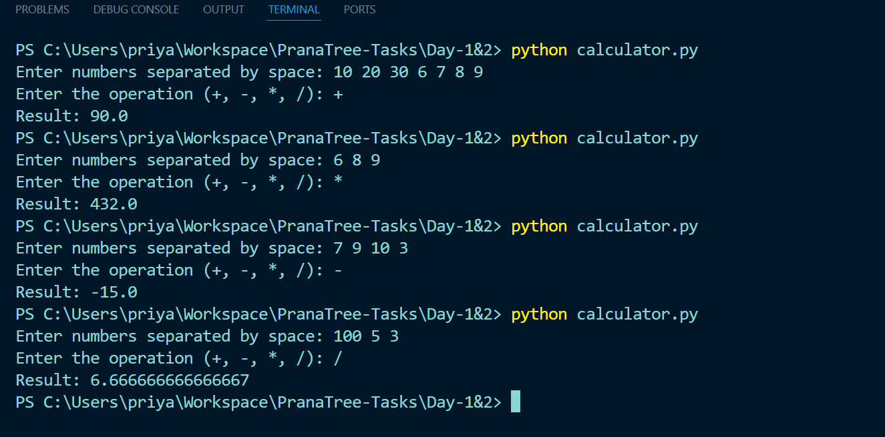

# Day 1 & 2:

## Leetcode Problems:

- Two sums - https://leetcode.com/problems/two-sum/submissions/1678536142/

- Palindrome Number - https://leetcode.com/problems/palindrome-number/submissions/1678560561/

- Merge two Sorted List - https://leetcode.com/problems/merge-two-sorted-lists/submissions/1678781728/

- Valid Parentheses - https://leetcode.com/problems/valid-parentheses/submissions/1678794771/

- Best Time to Buy and Sell Stocks - https://leetcode.com/problems/best-time-to-buy-and-sell-stock/submissions/1678805419/

- Contains Duplicate - https://leetcode.com/problems/contains-duplicate/submissions/1678809365/

- Valid Anagram - https://leetcode.com/problems/valid-anagram/submissions/1678799718/

- Intersection of 2 arrays - https://leetcode.com/problems/intersection-of-two-arrays-ii/submissions/1678815946/

- Majority Element - https://leetcode.com/problems/majority-element/submissions/1678823004/

- FizzBuzz - https://leetcode.com/problems/majority-element/submissions/1678823004/

## Basic Calculator for Two Numbers

